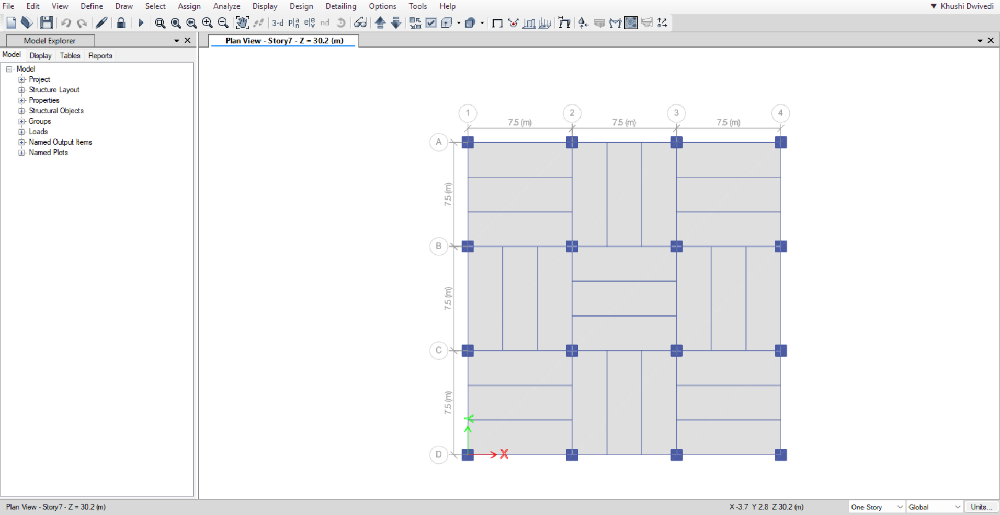
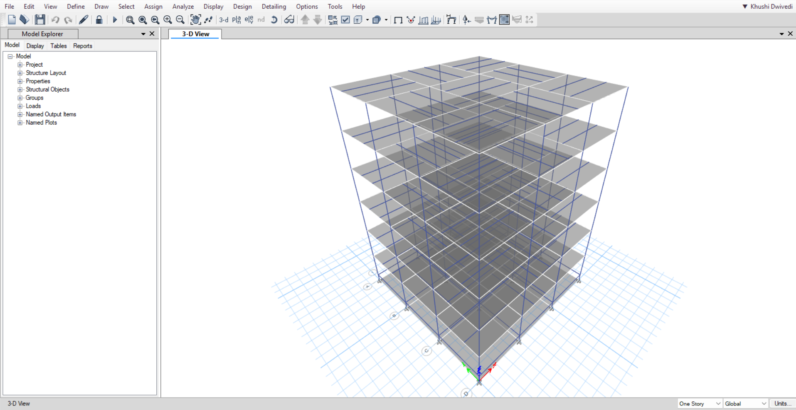
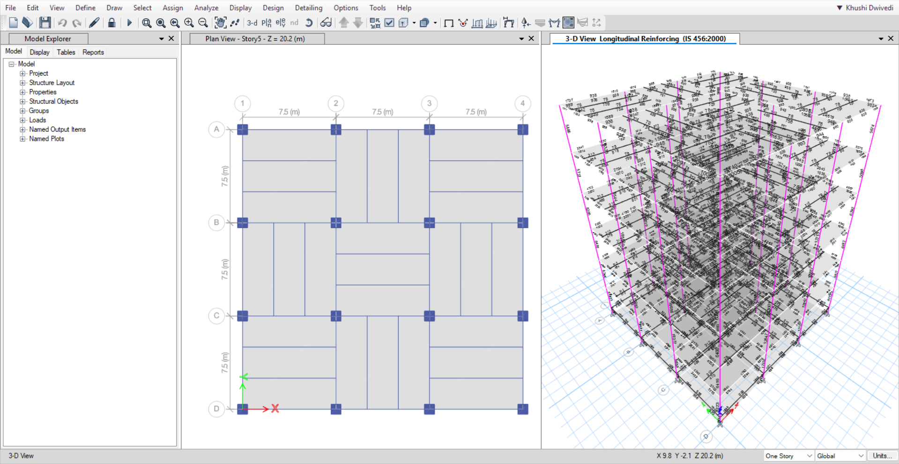
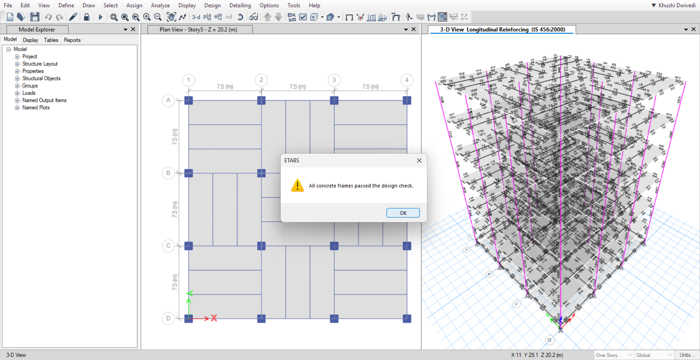

 # Seismic Analysis and Design of G+6 Building using ETABS
 
 This project involves structural modelling, analysis, and design of a G+6 commercial building using ETABS. The model is developed as per Indian Standards 
 (IS 456:2000 and IS 1893) considering seismic loading, load combinations, and reinforcement detailing.

The objective was to ensure structural safety, stability, and code compliance under gravity and earthquake loads.

# Key Features
- 3D structural modelling of G+6 building
- Load application: Dead, Live, and Seismic loads
- Load combinations as per IS codes
- Seismic analysis using response spectrum method
- Design of beams and columns (IS 456:2000)
- Verification using ETABS design check
- All structural members optimized to pass design criteria

## Model Views

### Plan View

### 3D Model

### Reinforcement View

### Design Status

# Tools Used
- ETABS Ultimate v23
- AutoCAD (for drafting reference)
- IS 456:2000
- IS 1893 (Seismic Design)
